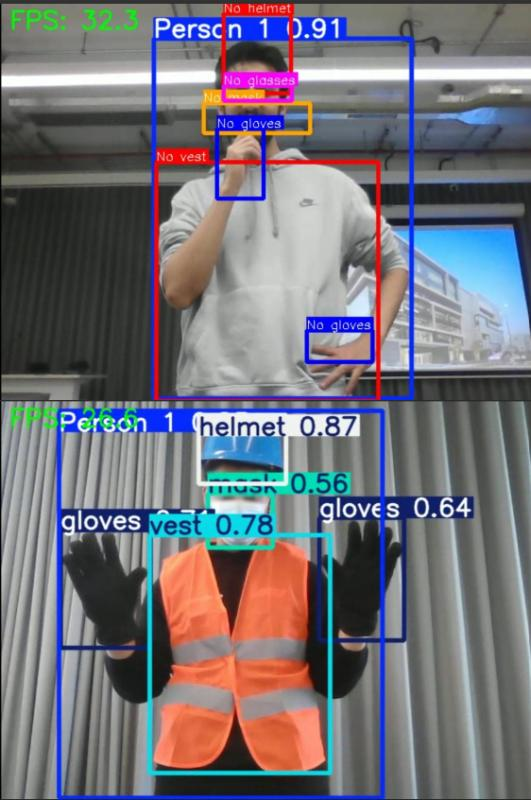

# 🦺 Real-Time PPE Detection using YOLOv5


An automated real-time **Personal Protective Equipment (PPE) detection system** for construction and industrial environments, built using **YOLOv5** object detection. The system identifies helmets, vests, gloves, glasses, and masks — and uniquely detects **missing PPE in real-time without retraining** additional classes.

Published at **AAAI 2025 Summer Symposium** → [Read the Paper](https://ojs.aaai.org/index.php/AAAI-SS/article/view/36044)

---

## 📦 Model Weights & Dataset

> ⚠️ Model weights (`.pt` files) are too large for GitHub. Download them below.

| Resource | Link |
|----------|------|
| 🤗 Trained Model Weights (`best.pt`) | [Hugging Face →](https://huggingface.co/DarthRegicid1/YOLOv5_PPE-Detection) |
| 📂 Datasets (Pictor-PPE, VOC2028, CHV) | Cited in [paper](https://ojs.aaai.org/index.php/AAAI-SS/article/view/36044) — see Dataset section below |

### Download Weights Locally
```python
from huggingface_hub import hf_hub_download

# Best performing model — YOLOv5m(a)
hf_hub_download(repo_id="Darth-Freljord/ppe-detection-yolov5", filename="yolov5m_a_best.pt")

# Lightweight model — YOLOv5s(a)
hf_hub_download(repo_id="Darth-Freljord/ppe-detection-yolov5", filename="yolov5s_a_best.pt")
```

---

## 📊 Results

| Model | mAP@0.5 | mAP@0.5:0.95 | Precision | Recall | FPS |
|-------|---------|--------------|-----------|--------|-----|
| **YOLOv5m(a)** *(best)* | **0.841** | **0.649** | **0.864** | **0.776** | 25–30 |
| YOLOv5s(a) | 0.736 | 0.409 | 0.748 | 0.721 | 35–40 |
| YOLOv5s(b) | 0.683 | 0.360 | 0.682 | 0.662 | 35–40 |

### YOLOv5m(a) Per-Class Breakdown

| Class | Precision | Recall | mAP@0.5 |
|-------|-----------|--------|---------|
| Helmet | 0.873 | 0.833 | 0.901 |
| Mask | 0.948 | 0.945 | 0.969 |
| Vest | 0.852 | 0.762 | 0.818 |
| Glasses | 0.860 | 0.744 | 0.812 |
| Gloves | 0.790 | 0.555 | 0.655 |
| Person | 0.860 | 0.816 | 0.890 |

### 📸 Model Inference & Live Demo

| Detection Output (Static) | Real-Time Inference (Live) |
|:---:|:---:|
|  |  |

> *Note: The image above shows the high-precision detection of PPE equipment, while the GIF demonstrates the real-time "No-PPE" detection logic in action.*

---

## 🗂️ Project Structure

```
├── train.py                    # YOLOv5 training script
├── detect_original.py          # Standard YOLOv5 inference
├── detect.py                   # Modified inference — YOLOv5s(a) with No-PPE detection
├── detect_mod.py               # Modified inference — YOLOv5m(a) with MediaPipe pose estimation
├── ppe_app/
│   ├── app.py                  # Flask backend — webcam feed, API endpoints
│   ├── src/
│   │   ├── App.js              # React frontend entry point
│   │   └── Home.js             # Model selection UI
├── data/
│   ├── data.yaml               # Dataset config
│   └── hyp.scratch-high.yaml   # Hyperparameter config
├── models/
│   └── yolov5m.yaml            # Model architecture config
├── utils/                      # YOLOv5 helper functions
├── runs/                       # Training outputs (weights, metrics)
└── node_modules/               # React frontend dependencies
```

---

## 🚀 Installation & Setup

### Prerequisites
- Python 3.8+
- CUDA-compatible GPU (recommended)
- Node.js (for React frontend)

### Install Python Dependencies
```bash
git clone https://github.com/Darth-Freljord/ppe-detection-yolov5.git
cd ppe-detection-yolov5
pip install -r requirements.txt
pip install huggingface_hub mediapipe flask flask-socketio
```

### Install Frontend Dependencies
```bash
cd ppe_app
npm install
```

---

## ▶️ Usage

### Run Inference (Command Line)

```bash
# YOLOv5s(a) — fast, lightweight
python detect_original.py --weights runs/train/exp6/weights/best.pt --source 0 --device 0

# YOLOv5s(b) — transfer learning variant
python detect_original.py --weights runs/train/ppe_3/weights/best.pt --source 0 --device 0

# YOLOv5m(a) — best accuracy, with No-PPE detection
python detect_original.py --weights runs/train/ppe_detection_m_896_v112/weights/best.pt --source 0 --device 0
```
> `--source 0` uses your webcam. Replace with a video file path or image folder as needed.

### Run the Demo App

```bash
# Start Flask backend
cd ppe_app
python app.py

# In a separate terminal, start React frontend
npm start
```
Then open `http://localhost:3000` in your browser.

---

## 📁 Dataset

Three publicly available datasets were merged into a single dataset of **9,675 images** (70:15:15 train/val/test split):

| Dataset | Images | Classes | Source |
|---------|--------|---------|--------|
| **Pictor-PPE** | 784 | Person, Helmet, Vest | ciber-lab (2019) |
| **VOC2028** | 7,581 | Person, Helmet | njvisionpower (2023) |
| **CHV** | 1,330 | Person, Vest, Helmet (multi-color) | ZijianWang-ZW (2020) |

The extended dataset for YOLOv5m(a) was augmented using a pretrained **YOLOv9** model to generate additional labels, increasing coverage for Mask, Gloves, and Glasses classes.

---

## 🧠 Models Trained

Three model variants were trained and evaluated:

- **YOLOv5s(a)** — Trained from scratch on original dataset, 640×640 input, 100 epochs
- **YOLOv5s(b)** — Transfer learning from COCO weights, 640×640 input, 50 epochs, 10 frozen layers
- **YOLOv5m(a)** — Best model. Trained on extended dataset, 896×896 input, anchor evolution over 100 iterations, Mosaic augmentation, MediaPipe pose-based No-PPE detection

### Key Innovation — No-PPE Detection Without Extra Classes
`detect.py` and `detect_mod.py` were modified to **dynamically detect missing PPE** (e.g. No-Helmet, No-Vest) by analysing detection outputs at runtime — no retraining required for negative classes.

---

## 📄 Publication

> **Seeing Safety: Computer Vision for Real-Time PPE Monitoring in the Middle East Construction Sector**
> Syed Suhail Ahmed
> *AAAI 2025 Summer Symposium — Context-Awareness in Cyber Physical Systems, Dubai, UAE*
> [Read on AAAI →](https://ojs.aaai.org/index.php/AAAI-SS/article/view/36044)

---

## 🛠️ Tech Stack


